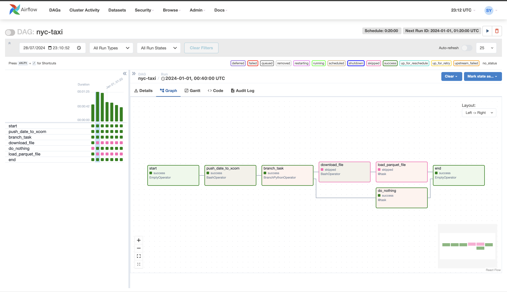
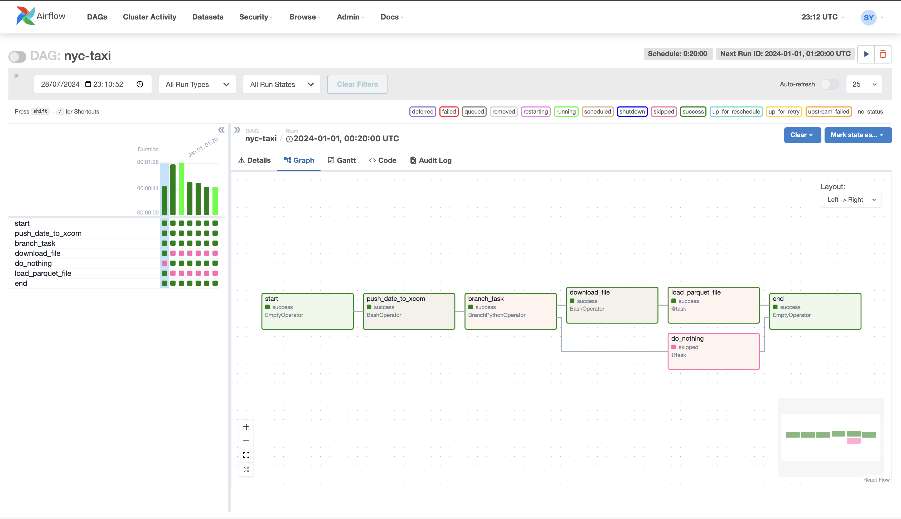

### **NYC TAXI PIPELINE WORKFLOW**

This is a demo project to process NYC Taxi datasets monthly (datasets can be found [here](https://www.nyc.gov/site/tlc/about/tlc-trip-record-data.page)).

This demo project uses the core features of airflow which include:
- Variables
- Xcom
- Hooks (Postgres Hook)
- Branching
- Custom Operator
- Connection

This project also uses panda library.

#### **DAG SUMMARY**

There are seven tasks included in the nyc taxi dag as seen in the two screenshots below. The first task (start) and the last task (end) are EmptyOperators and they execute at the start and end of the dag. 

**push_date_to_xcom** task get the execution date and saves the year month date(YYYY-MM) in xcom. 

**branch_task** task queries the table to check if there is any record for the execution year month in the postgres table. If yes, it executes the *do_nothing* task. Otherwise, it executes the *download_file* task to start processing the dataset data.

**do_nothing** task is executed if data already exist for the year month and it only logs a message to say there is no further processing.

**download_file** task is executed if no record exists for the execution year month. It downloads nyc taxi dataset file from the website and store in a specific path defined in the DAG variable.

**load_parquet_file** task process the parquet file using pandas. It loads the parquet into a dataframe and use the custom plugin created to persist the records into the database.

Below is a screenshot showing the dag execution that executes the *do_nothing* task

Below is a screenshot showing the dag execution that executes the *download_file* task

